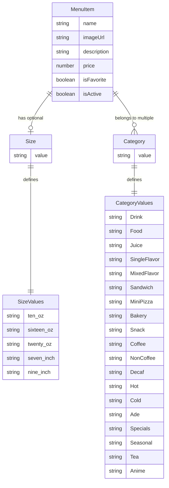
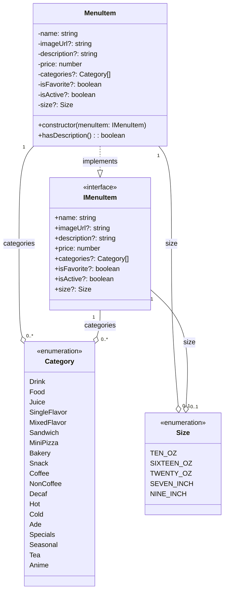

# Data Model

## Entity Relationship Diagram

## Class Diagram

## Data Model Description

### MenuItem

The core entity representing a menu item in the Haru Cafe system. Each menu item has:

- **Required fields**: name, price
- **Optional fields**: imageUrl, description, categories, isFavorite, isActive, size
- **Relationships**:
  - Can belong to multiple categories (many-to-many)
  - Can have one size (one-to-one, optional)

### Category

An enumeration defining the different types of menu item categories. Categories are used to classify and filter menu items. Notable characteristics:

- Multiple categories can be assigned to a single menu item
- Categories include broad types (Food, Drink) and specific subtypes (Coffee, NonCoffee, Hot, Cold)
- Some categories may be mutually exclusive (defined in `MutuallyExclusiveCategories`)

### Size

An enumeration defining available sizes for menu items:

- **Liquid measurements**: 10oz, 16oz, 20oz (for drinks)
- **Physical measurements**: 7", 9" (for food items like pizzas)
- Size is optional - not all menu items require size specification

